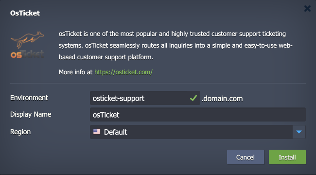

 

# osTicket

The package deploys the [osTicket](https://osticket.com/) solution - a widely used and trusted open-source support ticketing system. osTicket seamlessly routes all inquiries into a simple and easy-to-use web-based customer support platform. It offers features such as ticket filtering, automated responses, and customizable fields to enhance the support process.

## Environment Topology

This package creates a dedicated osTicket environment that contains one application server and one database container. It automatically deploys and sets the osTicket application. The automatic vertical scaling is enabled out of the box, and [horizontal scaling](https://www.virtuozzo.com/application-platform-docs/automatic-horizontal-scaling/) can be configured (if needed). The default software stacks utilized in the package are the following:

- Apache 2 PHP application server (PHP 8.1)
- MySQL 8 database
- osTicket 1.18.1

## Deployment to Cloud

To get your osTicket solution, click the "**Deploy to Cloud**" button below, specify your email address within the widget, choose one of the [Virtuozzo Public Cloud Providers](https://www.virtuozzo.com/application-platform-partners/), and confirm by clicking **Install**.

> If you already have a Virtuozzo Application Platform (VAP) account, you can deploy this solution from the [Marketplace](https://www.virtuozzo.com/application-platform-docs/marketplace/) or [import](https://www.virtuozzo.com/application-platform-docs/environment-import/) a manifest file from this repository.

## Installation Process

In the opened installation window at the VAP dashboard, provide a preferred environment and display names, choose a region (if available), and confirm the installation.

Your osTicket application will be automatically installed in a few minutes.
